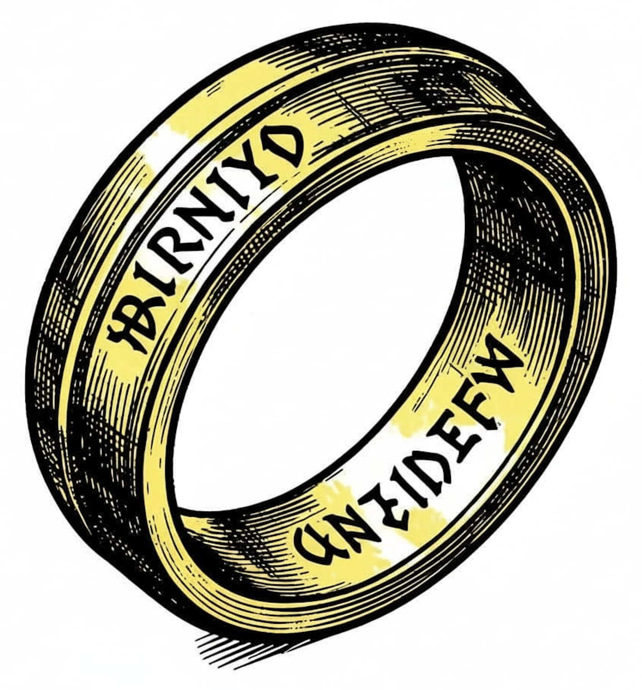

# sw-launcher



> One launcher to rule them all -- one boring, repeatable command in
> place of the dozen artisanal shell scripts that each AI agent
> reinvents.

## What is this?

`sw-launcher` is a host-side Rust CLI (binary: `sw-launch`) that turns
a *layered emulator scenario* into a single reproducible command. It
reads a `sw-launch.toml`, resolves pinned dependency layers, builds
artifacts (with caching), assembles a deterministic memory load plan,
invokes the target emulator, and checks expected output.

```
sw-launch run     <scenario>     # build + execute + check expectations
sw-launch build   <scenario>     # build all layers, do not execute
sw-launch check   <scenario>     # validate config + lockfile only
sw-launch graph   <scenario>     # print the layer DAG
sw-launch cache   list|explain|clean
sw-launch vendor  sync|status
sw-launch doctor                  # verify host tools
```

The full schema and validation rules are in
[`docs/design.md`](docs/design.md). The 13-repo survey that
grounds the schema is under [`docs/survey/`](docs/survey/).

It exists because every higher-level language project on the COR24
emulator (Pascal, p-code, OCaml, BASIC, Smalltalk, Forth, APL,
Macrolisp, PL/SW, SNOBOL4, ...) currently re-invents its own
`scripts/run-*.sh`, with mixed success: each one duplicates
`cor24-run --load-binary X@0 --load-binary Y@0x010000 --patch ...
--entry 0`, ships a different convention for where heaps and stacks
live, and gives AI agents enough rope to invent novel, broken
pipelines.

`sw-launch` is the one tool an agent calls instead.

## The problem in one picture

A real "OCaml interpreter on Pascal-on-p-code-VM, fed by source via
UART and a memory image at 0x080000" run looks like this:

```
+----------------------------------------+ 0x000000  <-- entry
| pvm.bin (COR24-native p-code VM)       |
|   embedded eval_stack / call_stack /   |
|   heap_seg                             |
+----------------------------------------+ ~0x03F000
| ocaml interpreter heap (grows down)    |  <- patched into heap_limit
+----------------------------------------+ 0x040000
| ocaml.p24m (Pascal -> p-code OCaml)    |  <- patched into code_ptr
+----------------------------------------+ 0x080000
| pre-built memory image (data)          |
+----------------------------------------+
| ... free SRAM ...                      |
+----------------------------------------+ 0xFEEC00  EBR (HW stack, do not touch)
+----------------------------------------+ 0xFF0000  MMIO
+----------------------------------------+

UART : OCaml source + EOT + runtime data
```

Every one of those addresses, sizes, and patches is currently chosen
by hand in a shell script. `sw-launch` makes the layout declarative,
checks for collisions before the emulator starts, caches built
artifacts by content hash, and pins dependency versions in a
lockfile.

## Status

**Phase 2 complete (2026-04-29)**: Scenario A and Scenario B both
run end to end. `sw-launch run pcode-hello` orchestrates a real
COR24 emulator with a `pvm` runtime + p-code app + cross-layer
`code_ptr` patch resolved through `pvm.lst`; UART output captured
matches the expected `"PVM OK\nHello\nHALT"`. 73 tests across 15
binaries pass.

Phase 3 (Scenario C: nested interpreter, heap-limit-only patches,
UART `<source>+EOT+<stdin>`, plus `ToolKind::PcodeLinker` so
`sw-launch` invokes `p24-load` directly) is described in
[`docs/saga-phase3-plan.md`](docs/saga-phase3-plan.md). See
[`docs/status.md`](docs/status.md) for the live phase tracker
and Phase 1 + Phase 2 closure summaries.

## Documentation

| Document | What's inside |
|---|---|
| [`docs/prd.md`](docs/prd.md) | Problem statement, scope, success criteria, naming |
| [`docs/architecture.md`](docs/architecture.md) | Modules, target backends, layers-as-composites, cache and vendor model |
| [`docs/design.md`](docs/design.md) | TOML schema, three primitive scenario shapes, memory segments per layer, validation rules with stable error codes |
| [`docs/plan.md`](docs/plan.md) | Phased rollout (Phase 0 survey, Phase 1 Scenario A, ..., Phase 5 multi-target) |
| [`docs/status.md`](docs/status.md) | Live phase / step status |
| [`docs/process.md`](docs/process.md) | TDD red/green/refactor cycle and pre-commit gate |
| [`docs/tools.md`](docs/tools.md) | Software Wrighter tool inventory (sw-checklist, markdown-checker, etc.) |
| [`docs/ai_agent_instructions.md`](docs/ai_agent_instructions.md) | Generated agent guidelines |
| [`docs/survey/`](docs/survey/) | Per-repo memory-layout survey (13 repos) plus index, schema gaps, tuplet failure hypothesis, monitor-shell feasibility, partition-model proposal |
| [`web/memory-layouts/`](web/memory-layouts/) | Static HTML with mermaid diagrams of every surveyed repo's memory layout. Serve with `./scripts/serve.sh` (port 5264) |
| [`CLAUDE.md`](CLAUDE.md) | Per-session agentrail protocol for AI coding agents |

## The three primitive scenario shapes

`sw-launch` exists to compose these three (and combinations of them):

- **Scenario A** -- one assembled `.s` at address 0, data via UART
- **Scenario B** -- a runtime (e.g. `pvm.bin`) at 0 plus a binary
  blob (e.g. a `.p24` p-code image) at a higher address, with a
  symbolic patch (e.g. `code_ptr -> 0x010000`)
- **Scenario C** -- runtime + interpreter + a reserved interpreter
  heap and stacks in high SRAM + source via UART (with EOT) +
  runtime data via UART, optionally with a fourth-layer DSL on top
  with its own heap

Each layer is `(artifact?) + (segments)`. Segments may be
**embedded** in the artifact (e.g. `pvm.s` reserves
`eval_stack`/`call_stack`/`heap_seg` internally) or **reserved** by
the loader at a configured high-SRAM address with patches that tell
the runtime where to find them. The COR24 hardware stack is only
3 KB EBR -- enough for `pvm.s` itself, nothing more -- so every
higher layer needs its own working memory placed and patched
explicitly. See [`docs/design.md`](docs/design.md) "Memory segments
per layer" for the schema.

## CLI surface (planned)

```
sw-launch run    <scenario>     # build (with cache) + execute + check expectations
sw-launch build  <scenario>     # build all layers, do not execute
sw-launch check  <scenario>     # validate config + lock; no tools spawned
sw-launch graph  <scenario>     # print the layer DAG
sw-launch cache  list|explain|clean
sw-launch vendor sync|status
sw-launch doctor                # verify host tools (cor24-run, pa24r, pl24r, ...)
```

Common flags: `-c <config>`, `--profile demo|test`, `--no-cache`,
`--rebuild <layer>`, `--update-lock`, `--explain`, `--dry-run`,
`--trace-loads`, `--report-json <path>`, `--timeout <ms>`.

See [`docs/design.md`](docs/design.md) "CLI surface" for the final
shape.

## Building (after Phase 1 lands)

```bash
cargo build --release
cargo test
cargo clippy --all-targets --all-features -- -D warnings
cargo fmt --check
sw-checklist
```

Pre-commit gate: every step in the saga ends with all five green.

## Targets

The first backend is COR24 (driven through `cor24-run`). The schema
intentionally accommodates additional targets (IBM 1130, RCA 1802,
RISC-V32) as plugin backends; those are out of scope for the first
sagas but baked into the architecture.

## Related repositories

- [sw-cor24-emulator](https://github.com/sw-embed/sw-cor24-emulator) -- COR24 emulator + ISA + `cor24-run`
- [sw-cor24-pcode](https://github.com/sw-embed/sw-cor24-pcode) -- p-code VM (`pvm.s`), assembler (`pa24r`), linker (`pl24r`)
- [sw-cor24-pascal](https://github.com/sw-embed/sw-cor24-pascal) -- Pascal compiler (emits `.spc`)
- [sw-cor24-ocaml](https://github.com/sw-embed/sw-cor24-ocaml) -- OCaml interpreter on p-code
- [sw-cor24-basic](https://github.com/sw-embed/sw-cor24-basic) -- BASIC interpreter
- [sw-cor24-forth](https://github.com/sw-embed/sw-cor24-forth) -- Forth in COR24 assembly
- [sw-cor24-project](https://github.com/sw-embed/sw-cor24-project) -- ecosystem hub

The full list of repos `sw-launch` is designed to consolidate is in
[`docs/plan.md`](docs/plan.md) Phase 0.

## Links

- Blog: [Software Wrighter Lab](https://software-wrighter-lab.github.io/)
- Discord: [Join the community](https://discord.com/invite/Ctzk5uHggZ)
- YouTube: [Software Wrighter](https://www.youtube.com/@SoftwareWrighter)

## Copyright

Copyright (c) 2026 Michael A. Wright

## License

MIT License. See [LICENSE](LICENSE) for the full text.
